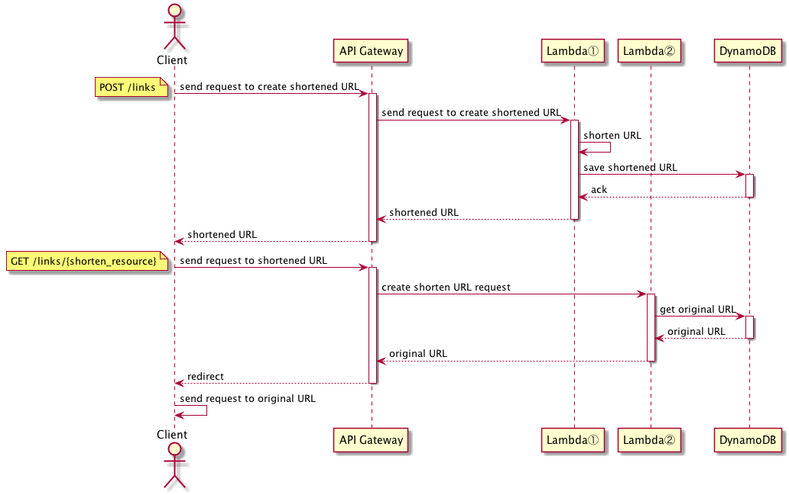

url-shortner-lambda-go
====

## Description
url-shortner-lambda-go is a service to shorten URL using AWS Lambda and DynamoDB




## Production

### prerequisites

You have to prepare credentials with proper policies.

And,

* install [aws-cli](https://github.com/aws/aws-cli)
* install [aws-sam-cli](https://github.com/awslabs/aws-sam-cli). Docker is also required. Follow the instruction [here](https://github.com/awslabs/aws-sam-cli#installation).
* install [direnv](https://github.com/direnv/direnv)
* install [saw](https://github.com/TylerBrock/saw)
  * you can watch CloudWatch logs on your terminal
* set environment variables to [.envrc.sample](./.envrc.sample) and remove *.sample*.
  * *LINK_TABLE* is DynamoDB table name where maps of your original URLs and shortend resource are gonna be saved. 
  * *REGION* is where your project is gonna be deployed. 
  * *STACK_BUCKET* is S3 bucket name for artifacts of SAM and should be unique globally.

### deploy

```
$ dep ensure                       # to resolve dependency
$ aws s3 mb "s3://${STACK_BUCKET}" # for artifacts of SAM
$ make deploy
# Your endpoint is gonna be pirinted.

# You can change url for your own.
$ curl -X POST https://yyyyyyyyyy.execute-api.[your region].amazonaws.com/Prod/links -d '{"url":"http://toshi0607.com/"}'
xxxxxxxxx

then you can access https://yyyyyyyyyy.execute-api.[your region].amazonaws.com/Prod/links/xxxxxxxxx and it'll be redirected to the original URL.
```

### log

Deploy is required before checking behavior.

```
$ saw groups
/aws/lambda/url-shortener-lambda-go-Redirect-XXXXXXXXXXXX
/aws/lambda/url-shortener-lambda-go-Shorten-XXXXXXXXXXXX

$ saw watch /aws/lambda/url-shortener-lambda-go-Redirect-XXXXXXXXXXXX &
$ saw watch /aws/lambda/url-shortener-lambda-go-Shorten-XXXXXXXXXXXX &

# open another window
$ curl -X POST https://yyyyyyyyyy.execute-api.[your region].amazonaws.com/Prod/links -d '{"url":"http://toshi0607.com/"}'
```

## Local

You can test AWS Lambda & API Gateway locally with [AWS SAM (Serverless Application Model)](https://github.com/awslabs/serverless-application-model).

### hosting

```
$ sam local start-api # you have to use DynamoDB 

# You can change url for your own.
$ curl -X POST http://127.0.0.1:3000/links -d '{"url":"http://toshi0607.com/"'}
xxx

then you can access http://127.0.0.1:3000/links/xxxxxxxxx and it'll be redirected to the original URL.
```

### testing

[DynamoDB local](https://docs.aws.amazon.com/amazondynamodb/latest/developerguide/DynamoDBLocal.html) is useful as well.

You can try to use the DynamoDB local in test as below.

```
$ docker pull amazon/dynamodb-local
$ docker run -p 8000:8000 amazon/dynamodb-local
$ make test
```

## Articles (Japanese)

* [Goで学ぶAWS Lambda（PDF、ePubセット版）](https://toshi0607.booth.pm/items/1034858)
  * This architecture is explained in detail in this book.
* [技術書典5で『Goで学ぶAWS Lambda』を出展します #技術書典](http://toshi0607.com/programming/learning-aws-lambda-with-go/)
* [技術書典5の『Goで学ぶAWS Lambda』の振り返りとフィードバックのお願い #技術書典](http://toshi0607.com/event/review-of-tbf5/)
